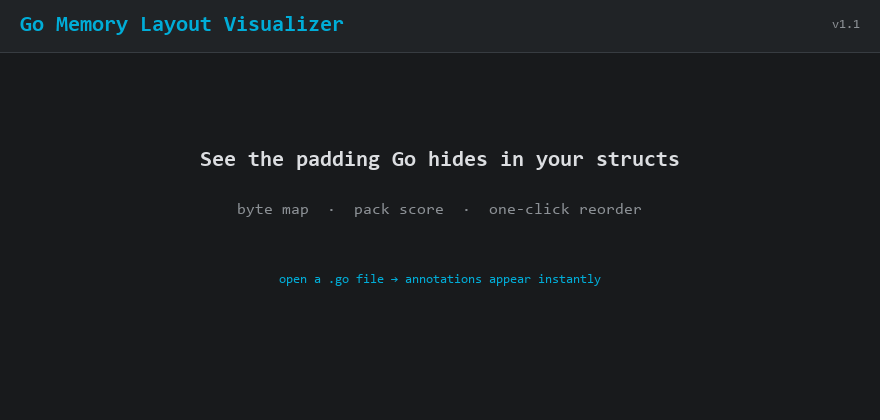

# Go Memory Layout Visualizer

<p align="center">
  
</p>

<p align="center">
  <b>See the padding Go inserts. Reorder in one click.</b><br/>
  Inline annotations · visual byte map · pack score · cache lines · amd64/arm64/386
</p>

<p align="center">
  <a href="https://marketplace.visualstudio.com/items?itemName=RhinoSoftware.go-memory-visualizer"></a>
  <a href="https://open-vsx.org/extension/RhinoSoftware/go-memory-visualizer"></a>
  <a href="LICENSE"></a>
  
</p>

**Install:** `ext install RhinoSoftware.go-memory-visualizer`  
Or: [Marketplace](https://marketplace.visualstudio.com/items?itemName=RhinoSoftware.go-memory-visualizer) · [Open VSX](https://open-vsx.org/extension/RhinoSoftware/go-memory-visualizer) · [Website](https://1rhino2.github.io/go-memory-visualizer/)

---

### 30 seconds to “oh”

```go
type Sparse struct {
    Active bool    // 1B + 7B padding
    ID     uint64
    Tag    uint8   // 1B + 7B padding
    Name   string
}
// 40B · pack 65% · 14B wasted
```

Open the file → annotations appear → click **Optimize Layout (save 8B · pack 65%)**:

```text
Sparse  40B  pack 65%  pad 14B
0000  A.......BBBBBBBB
0010  C.......DDDDDDDD
0020  DDDDDDDD
legend: A=Active  B=ID  C=Tag  D=Name  .=padding
```

After reorder: **32B · pack 85% · saved 8 bytes**. Same fields, less air.

---

## Why people install this

- Spot padding without running `unsafe.Sizeof` or reading the Go ABI by hand
- Cut struct size 10–30% on hot types (API responses, events, DB models)
- Teach juniors (and yourself) how alignment actually works
- Paste the ASCII map into a PR when you want reviewers to see the waste

## Features

### Real-Time Analysis

- Inline annotations showing memory details for each field
- Byte offsets so you know exactly where fields live
- Size calculations and alignment requirements
- Padding detection with visual warnings

### Visual Feedback

- Color-coded warnings for excessive padding
- Cache line boundary detection (64-byte warnings)
- Hover tooltips with detailed breakdowns
- CodeLens buttons for one-click optimization

### Optimization Tools

- Automatic field reordering by alignment and size
- Shows exact bytes saved before and after
- Preview before rewrite (current vs proposed order + pack score)
- Preserves your comments and struct tags
- Safe refactoring that doesn't break anything
- Works with nested and embedded structs
- Keeps grouped field lines intact when optimizing

### Visual Memory Map (new in v1.1)

- Byte-level colored grid for the struct under the cursor
- ASCII map you can paste into reviews or docs
- Pack score: how much of the struct is real data vs padding

### Export and Reporting

- Export memory layout reports to JSON, Markdown, or CSV
- Detailed field-by-field analysis with offset, size, alignment, and padding information
- Architecture-specific reports for cross-platform analysis
- Perfect for documentation, code reviews, and performance audits

### v1 Accuracy

- Same-file type aliases and alias blocks resolve to their underlying Go types
- Slices use Go's three-word slice header size on each supported architecture
- `complex64` uses 8 bytes with 4-byte alignment, matching Go's layout rules
- `error` and any same-file `type X interface { ... }` declarations are sized
  as 2-word interface values (16 bytes amd64/arm64, 8 bytes 386)
- Anonymous inline struct fields (`Inner struct { ... }`) are parsed and
  sized recursively, including multi-line declarations
- `unsafe.Pointer` is treated as a pointer-sized value

### Multi-Architecture Support

Supports amd64, arm64, and 386. Switch between them to see how pointer sizes affect layout.

---

## Installation

### From VS Code Marketplace

1. Open VS Code
2. Press `Ctrl+P` (Windows/Linux) or `Cmd+P` (Mac)
3. Type: `ext install RhinoSoftware.go-memory-visualizer`
4. Press Enter

Or visit the [VS Code Marketplace](https://marketplace.visualstudio.com/items?itemName=RhinoSoftware.go-memory-visualizer)

### From Source

```bash
git clone https://github.com/1rhino2/go-memory-visualizer.git
cd go-memory-visualizer
npm install
npm run compile
code .
# Press F5 to launch Extension Development Host
```

---

## Quick Start

### 1. Open a Go File

Create or open any `.go` file with struct definitions:

```go
type User struct {
    Active    bool    //  1 byte + 7 padding
    ID        uint64  // 8 bytes
    Name      string  // 16 bytes
    Age       uint8   //  1 byte + 7 padding
    Balance   float64 // 8 bytes
}
```

### 2. See Instant Analysis

The extension automatically shows:

```text
// offset: 0 | size: 1 | align: 1 | padding: 7 
Active    bool

// offset: 8 | size: 8 | align: 8 | padding: 0
ID        uint64

// Total: 48 bytes | Padding: 14 bytes (29% waste)
```

### 3. Optimize with One Click

Click the CodeLens button above the struct:

```text
 Optimize struct - save 14 bytes (29% reduction)
```

### 4. See Optimized Result

```go
type User struct {
    ID        uint64  // 8 bytes (no padding)
    Balance   float64 // 8 bytes (no padding)
    Name      string  // 16 bytes (no padding)
    Active    bool    // 1 byte (no padding)
    Age       uint8   // 1 byte + 6 final padding
}
// Total: 40 bytes | Padding: 6 bytes (15% waste)
//  Saved 8 bytes (16.7% reduction)
```

---

## Commands

Access via Command Palette (`Ctrl+Shift+P` / `Cmd+Shift+P`):

| Command | Description |
|---------|-------------|
| `Go: Show Memory Layout` | Display detailed memory breakdown for all structs |
| `Go: Show Visual Memory Map` | Byte-level colored map + ASCII for the struct at cursor |
| `Go: Optimize Struct Memory Layout` | Reorder fields in struct at cursor to minimize padding |
| `Go: Toggle Architecture` | Switch between amd64, arm64, and 386 |
| `Go: Export Memory Layout Report` | Export struct analysis to JSON/Markdown/CSV |
| `Go: Analyze Workspace Memory Layout` | Scan the workspace for padding and cache line issues |
| `Go: Compare Struct Layout Across Architectures` | Side-by-side amd64/arm64/386 layout for the struct at cursor |

Optimization is also available as a Quick Fix (`Ctrl+.` / `Cmd+.`) on any
struct that can be reordered for savings, and the status bar shows the total
bytes saveable in the current file at a glance. High-padding,
optimization-eligible, and cache-line-crossing structs are surfaced in the
Problems panel via diagnostics.

---

## Configuration

Customize via VS Code Settings (`Ctrl+,` / `Cmd+,`):

```json
{
  // Default architecture for memory calculations
  "goMemoryVisualizer.defaultArchitecture": "amd64",
  
  // Show inline annotations above struct fields
  "goMemoryVisualizer.showInlineAnnotations": true,
  
  // Highlight fields with excessive padding
  "goMemoryVisualizer.highlightPadding": true,
  
  // Minimum padding bytes to trigger warning (default: 8)
  "goMemoryVisualizer.paddingWarningThreshold": 8,
  
  // Show warnings for cache line boundary crossings
  "goMemoryVisualizer.showCacheLineWarnings": true,

  // Ask before rewriting field order (shows before/after preview)
  "goMemoryVisualizer.confirmBeforeOptimize": true,

  // Size time.Time, sync.Mutex, atomic.*, etc. from known layouts
  "goMemoryVisualizer.useKnownStdlibTypes": true
}
```

### Configuration Details

| Setting | Type | Default | Description |
|---------|------|---------|-------------|
| `defaultArchitecture` | string | `"amd64"` | Architecture for calculations: `amd64`, `arm64`, or `386` |
| `showInlineAnnotations` | boolean | `true` | Display memory info above each field |
| `highlightPadding` | boolean | `true` | Highlight fields with padding waste |
| `paddingWarningThreshold` | number | `8` | Min padding bytes to show warning |
| `showCacheLineWarnings` | boolean | `true` | Warn about 64-byte cache line crossings |
| `confirmBeforeOptimize` | boolean | `true` | Preview before rewriting field order |
| `useKnownStdlibTypes` | boolean | `true` | Size time/sync/atomic/context from known layouts |

---

## Examples

See `examples/structs.go` for demonstrations of:

- **Well-optimized structs** (minimal padding)
- **Poorly-optimized structs** (excessive padding)
- **Common anti-patterns** to avoid
- **Best practices** for field ordering

### Real-World Savings

#### API Response (56 to 48 bytes, 14% reduction)

**Before:**
```go
type APIResponse struct {
    Success   bool      // 1 + 7 padding
    Timestamp int64     // 8
    Message   string    // 16
    Code      int32     // 4 + 4 padding
    RequestID string    // 16
}
// 56 bytes, 11 bytes wasted
```

**After:**
```go
type APIResponse struct {
    Timestamp int64     // 8
    Message   string    // 16
    RequestID string    // 16
    Code      int32     // 4
    Success   bool      // 1 + 3 final padding
}
// 48 bytes, 3 bytes wasted
```

**Impact**: 1M responses = **8 MB saved**

---

## New in v0.2.0

### Nested Struct Support

The extension now automatically calculates memory layout for structs containing other custom structs:

```go
type Point struct {
    X float64 // 8 bytes
    Y float64 // 8 bytes
}

type Rectangle struct {
    TopLeft  Point  // 16 bytes (nested struct)
    Width    uint32 // 4 bytes
    Height   uint32 // 4 bytes
}
// Total: 24 bytes
```

The parser performs two-pass analysis:

1. First pass: Register all struct definitions
2. Second pass: Calculate layouts with nested struct sizes resolved

### Embedded Field Handling

Embedded fields (promoted fields) are now properly detected and analyzed:

```go
type Base struct {
    ID        uint64 // 8 bytes
    CreatedAt int64  // 8 bytes
}

type User struct {
    Base           // embedded: 16 bytes
    Name   string  // 16 bytes
    Active bool    // 1 byte + 7 padding
}
// Total: 40 bytes
```

Embedded pointers are also supported:

```go
type Document struct {
    *Metadata         // embedded pointer: 8 bytes
    Title     string  // 16 bytes
    Published bool    // 1 byte
}
```

### Export Memory Layout Reports

New command to export detailed struct analysis:

**JSON Format**: Machine-readable with full field details

```json
{
  "structs": [{
    "name": "User",
    "totalSize": 40,
    "alignment": 8,
    "totalPadding": 7,
    "paddingPercentage": 17.5,
    "fields": [...]
  }],
  "architecture": "amd64",
  "exportedAt": "2025-11-23T12:00:00.000Z"
}
```

**Markdown Format**: Human-readable documentation

```markdown
## User

- **Total Size:** 40 bytes
- **Alignment:** 8 bytes
- **Total Padding:** 7 bytes (17.5%)

### Fields

| Field | Type | Offset | Size | Alignment | Padding After |
|-------|------|--------|------|-----------|---------------|
| ID    | uint64 | 0    | 8    | 8         | 0             |
```

**CSV Format**: Perfect for spreadsheets and data analysis

```csv
Struct,Field,Type,Offset,Size,Alignment,Padding After,Total Size,Total Padding,Padding Percentage,Architecture
User,ID,uint64,0,8,8,0,40,7,17.5,amd64
```

**Usage:**

1. Open a Go file with struct definitions
2. Run command: `Go: Export Memory Layout Report`
3. Choose format: JSON, Markdown, or CSV
4. Save to desired location

Perfect for:

- Code reviews and documentation
- Performance audits
- Cross-architecture analysis
- Team collaboration

---

## How It Works

### Memory Layout Calculation

The extension follows Go's alignment rules:

1. **Type Alignment**: Each type has an alignment requirement:
   - `bool`, `int8`, `uint8`: 1 byte
   - `int16`, `uint16`: 2 bytes
   - `int32`, `uint32`, `float32`: 4 bytes
   - `int64`, `uint64`, `float64`: 8 bytes
   - Pointers, strings, slices: 8 bytes (amd64/arm64), 4 bytes (386)

2. **Field Placement**: Each field starts at an offset aligned to its requirement

3. **Padding Insertion**: Go adds padding bytes to satisfy alignment

4. **Final Padding**: Struct size is rounded up to largest field alignment

### Optimization Algorithm

```
1. Extract all fields from struct
2. Calculate current layout and total size
3. Sort fields:
   - Primary: by alignment (descending)
   - Secondary: by size (descending)
4. Recalculate layout with new ordering
5. Compare sizes and show savings
```

---

## Testing

Run the comprehensive test suite:

```bash
npm test
```

**Test Coverage:**

- 52 automated tests across parser, calculator, optimizer, diagnostics,
  arch compare, memory map, and known stdlib types
- CI runs compile, lint, and tests on Node 20 and 22

---

## Documentation

- **[DEMO.md](DEMO.md)**: Interactive demonstrations and visual examples
- **[DEVELOPMENT.md](DEVELOPMENT.md)**: Developer guide and architecture
- **[CHANGELOG.md](CHANGELOG.md)**: Version history and release notes

---

## Contributing

Contributions welcome! Please:

1. Fork the repository
2. Create a feature branch (`git checkout -b feature/amazing-feature`)
3. Commit changes (`git commit -m 'Add amazing feature'`)
4. Push to branch (`git push origin feature/amazing-feature`)
5. Open a Pull Request

### Development Setup

```bash
git clone https://github.com/1rhino2/go-memory-visualizer.git
cd go-memory-visualizer
npm install
npm run compile
npm test
```

---

## Requirements

- **VS Code**: 1.85.0 or higher
- **Go files**: `.go` extension in workspace
- **Node.js**: 20.x or higher (for development)

---

## Known Issues

None for v1.0.0. Previous limitations resolved:

- ~~Nested struct support~~ ✅ Added in v0.2.0
- ~~Embedded struct handling~~ ✅ Added in v0.2.0
- ~~Same-file type aliases~~ ✅ Added in v1.0.0
- Union type support (planned)

See [GitHub Issues](https://github.com/1rhino2/go-memory-visualizer/issues) for full list.

---

## License

MIT License - see [LICENSE](LICENSE) file for details.

---

## Acknowledgments

- Inspired by Go's memory layout documentation
- Built with VS Code Extension API
- Thanks to the Go community for feedback

---

## Support

- **Issues**: [GitHub Issues](https://github.com/1rhino2/go-memory-visualizer/issues)
- **Discussions**: [GitHub Discussions](https://github.com/1rhino2/go-memory-visualizer/discussions)
- **Contact**: 1rhino2 on discord

---

## Roadmap

### v0.2.0 - Released 2025-11-23

- [x] Nested struct support
- [x] Embedded field handling
- [x] Export layout reports

### v0.2.1 - Released 2025-11-26

- [x] Fixed export error handling
- [x] Updated deprecated API usage

### v0.2.2 - Released 2025-11-26

- [x] **Security fix**: Patched path traversal vulnerability in export function
- [x] Added path validation and normalization
- [x] Implemented write verification and explicit file permissions

### v0.3.0 - Released 2025-12-03

- [x] **Cache line visualization**: Shows which 64-byte cache line each field occupies
- [x] **Cache line crossing detection**: Warns when fields span multiple cache lines
- [x] **Workspace analyzer**: New command scans all Go files for optimization opportunities
- [x] Hot field detection for false sharing risks

### v0.3.1 - Released 2025-12-05

- [x] **Security update**: Fixed 18 security vulnerabilities (3 critical, 4 high, 10 medium, 1 low)
- [x] XSS prevention with HTML/Markdown escaping
- [x] Content Security Policy for webviews
- [x] ReDoS protection with simplified regex patterns
- [x] Resource limits for workspace analyzer
- [x] See [Security Advisory](https://1rhino2.github.io/go-memory-visualizer/security.html)

### v1.1.0 - Released 2026-07-15

- [x] Visual memory map (byte grid + ASCII)
- [x] Pack score in status bar, CodeLens, and exports
- [x] Optimize preview with confirm-before-rewrite
- [x] Known stdlib type sizes (time, sync, atomic, context)

### Future

- [ ] Union / sum-type visualization helpers
- [ ] Bitfield visualization
- [ ] Optional `unsafe.Sizeof` cross-check via gopls

---

<p align="center">
  <strong>Made for the Go community</strong>
</p>

<p align="center">
  <a href="https://1rhino2.github.io/go-memory-visualizer">Website</a> •
  <a href="https://github.com/1rhino2/go-memory-visualizer">GitHub</a> •
  <a href="https://marketplace.visualstudio.com/items?itemName=RhinoSoftware.go-memory-visualizer">Marketplace</a> •
  <a href="DEVELOPMENT.md">Docs</a>
</p>
